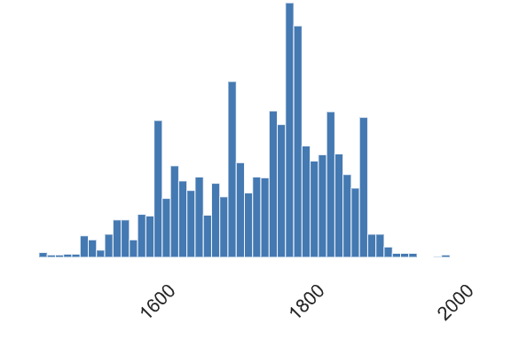
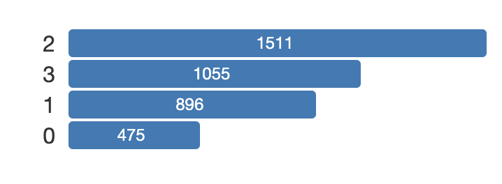
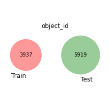
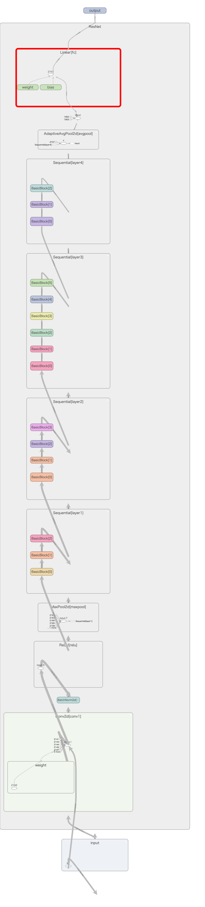

# [atmacup11](https://www.guruguru.science/competitions/17/)
atmacup#11 美術作品の年代予測

# Table of content
- [Basic](#Basic)
- [Log](#Log)
    - [20210709](#20210709)
   

# Basic

## info

## NOTE
- 事前学習済みモデルの利用はNG
- private LBの計算に２つのサブを選択、そのうち良い方をprivate最終順位に使用する
- チームを組んでいないユーザー同士でのアイデアの交換はNG。SNSでの発信もNG

### 予測対象について

予測対象は、train.csvのtarget　{0, 1, 2, 3}

**美術作品の年代カテゴリ**

代表年を x としたとき、ルールは以下のとおりです。

- 16世紀以前 (x <= 1600): 0
- 17世紀 (1601 < x <= 1700): 1
- 18世紀 (1701 < x <= 1800): 2
- 19世紀以降 (1800 < x): 3

## Evaluation
評価指標はRMSE.

## Datasets

[配布リンク](https://www.guruguru.science/competitions/17/data-sources)

- train.csv : size(3937, 4)
- test.csv : size(5919, 1)
- photos.zip
- materials.csv : size(9081, 2)
- techniques.csv : size(3777, 2)

# Log

## 20210709
- join！！！
- data download

- sorting_dateとtargetの違い(train.csv)
    - sorting_dateから年代分けられるんじゃないの？と思ったけど、test.csvにsorting_dateカラムがないみたい。
    - test.csvにはobject_idのみ
    - つまり、test.csvのobject_idから作品画像を読み込む→画像の特徴から年代を予測するということか。
    
- nb001
    - "counterproof"という技法、「版画」という意味らしい。
    - trainのデータ、18世紀の作品が最も多いらしい。次いで、１９世紀以降、１７世紀、１６世紀以前の順に多い。
    
|作品代表年(train)|target(train)|
|---|---|
|||
    
## 20210710
- 画像データからmaterials, techniquesを紐づけて、それに関して予測もする（○世紀の作品は材質がx, 技法がyのものが多い、など）

- nb001
    - trainとtestで、object_idの被りがないか一応確認
    - 被りはないみたい
    
    
    
- [tawaraさんのディスカッション](https://www.guruguru.science/competitions/17/discussions/3bd8027c-fbd8-413d-b0a2-0421614d0849/)を読む
    - "sorting_dateを回帰予測して、その値をtargetの離散値に後処理変換する" ・・・　なるほど！！
    - "CNNの事前学習"と”メインの学習”というので２ステップに分かれているみたい
    - 事前学習の目的は？ train:test = 4000:6000と元々の訓練データが少なく不十分だから事前学習してあげる必要があるんかな？
    - `art_series_id`について
        - >シリーズ物の作品に対してユニークなID. train / test はこのカラムに重複がないように分割されています。
        - trainと同じシリーズの作品はtestには含まれないということか。
        - `art_series_id`に対してGroupKFoldでクロスバリデーションをして評価した方が良さそう。　未知のシリーズに対する予測を適切にするため。
        
        
- 画像によってサイズが異なる？
    - [本ディスより](https://www.guruguru.science/competitions/17/discussions/225c07a3-b5f9-4247-bb56-65159f1c5803/)
    - 確認してみよう
    - 画像のサイズ・チャネル数に[このディス](https://www.guruguru.science/competitions/17/discussions/c91c9c19-a907-4de9-89aa-294542758590/)が参考になった
    
## 20210710
- atmacup, 初心者講座第一回
- 公式notebookを動かした

## 20210711
- 公式notebookからどう変えるか。

- 検討事項
    1. エポック数はどうするか？　・・・色々エポック数変えながら
    2. データ拡張何か変える？
    3. 最適化手法は何にするか？(Adam, RMSProp, ...)
    4. その最適化手法のパラメータは？(lr, モーメンタム)
        - 基本的にoptimizerのパラメータはデフォが推奨らしい（lrぐらいか、いじるのは）. keras docより
        
- エポック数について
    - 適切なエポック数について、[このサイトの言及](https://qiita.com/kenta1984/items/bad75a37d552510e4682)がわかりやすかった
    - 結論、何回エポックを回せばいいのか？　-> <h3>"損失関数（コスト関数）の値がほぼ収束するまで"</h3>
    
- nb004
    - nb003を参考に、エポック数を３->100に変えただけ
    - サブミッション 001
        - CV: x(測ってなかった)
        - LB: 0.9399
- nb005
    - ResNet34の中身理解のために tensorboardで可視化した
    - MaxPooling : 例えば、2x2のフィルタに対して、最大値を返す。→次元削減される
    
    
    
    - 最後の全結合層を1次元出力に変えたのだけど、tensorboardに何故か反映されず。 1x1000のまま。
    
    
- nb006
    - StratifiedGroupKFold インポートできるかどうかテスト
    - エラー発生したが解決済み。　[実施内容はディスカッションに起案済み](https://www.guruguru.science/competitions/17/discussions/6244b237-7845-41d4-8fe1-ea5f91aefaf1/)